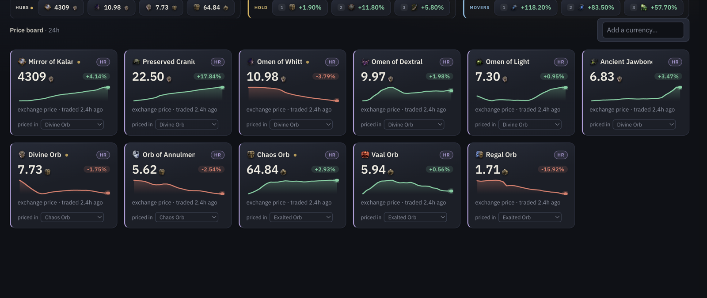
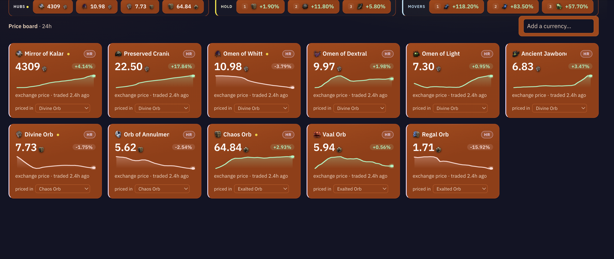
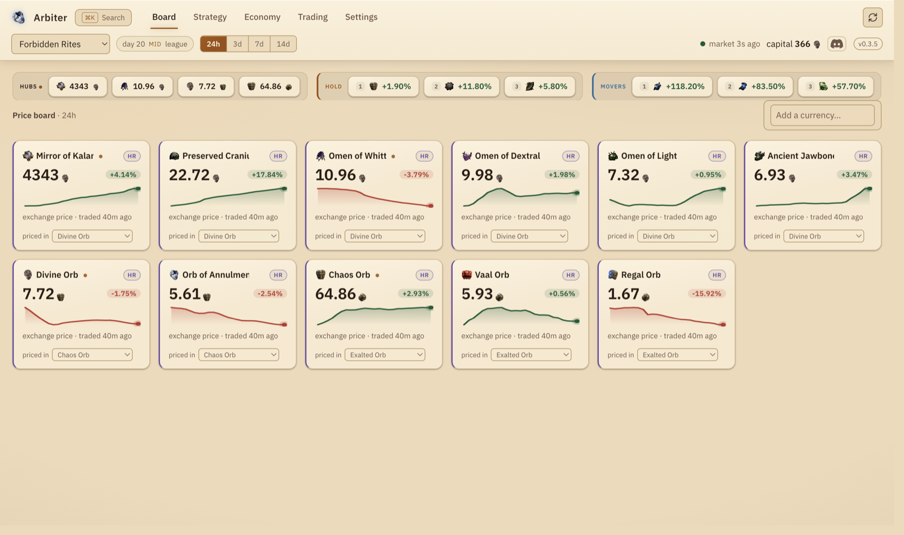
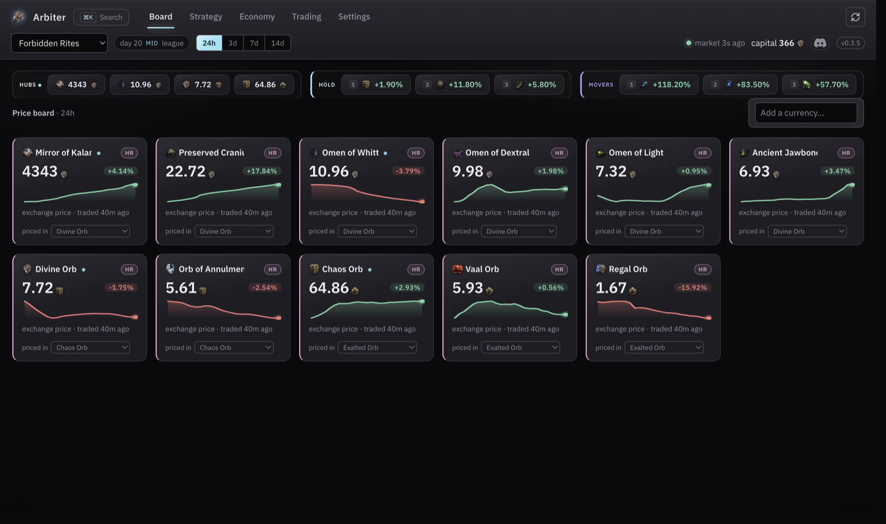
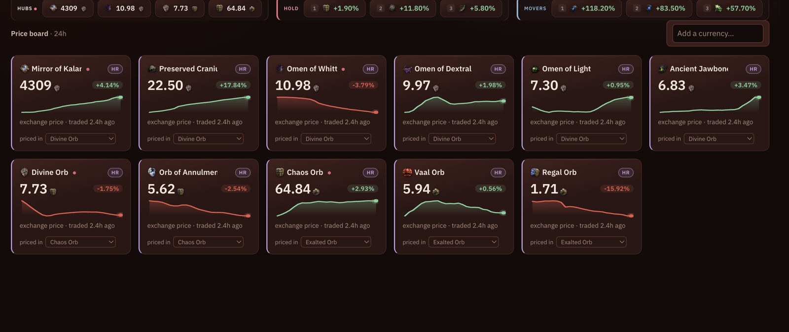
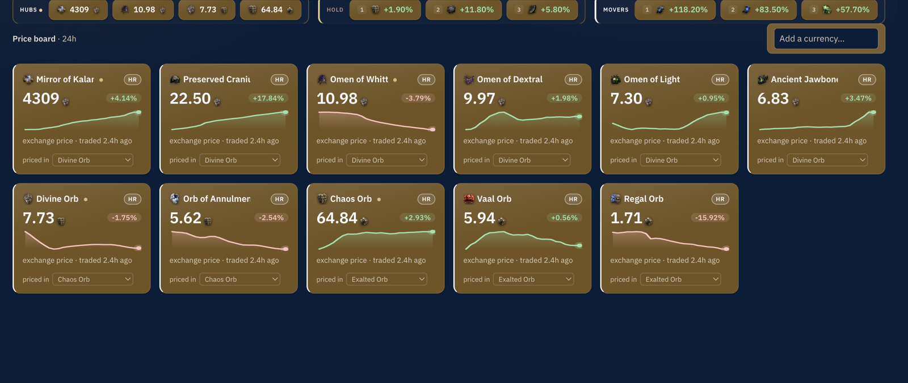
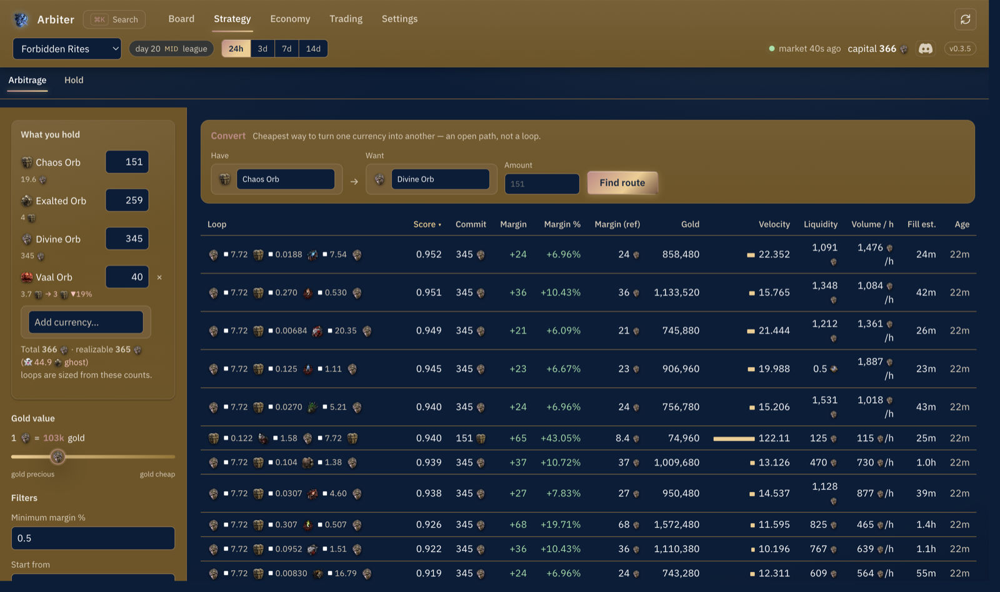
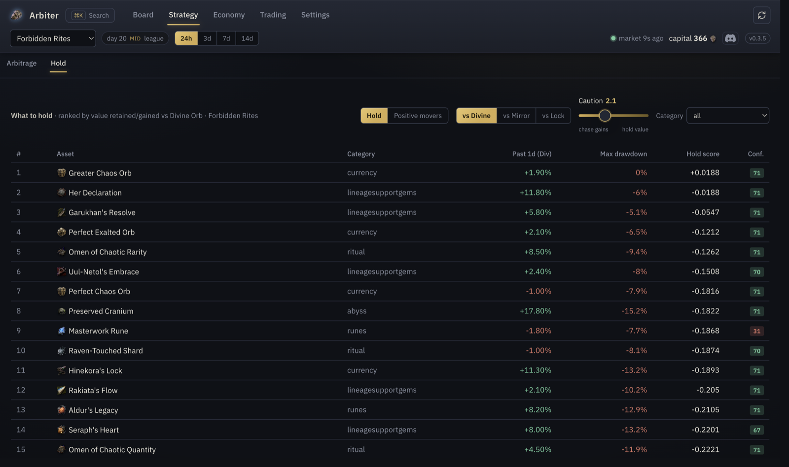
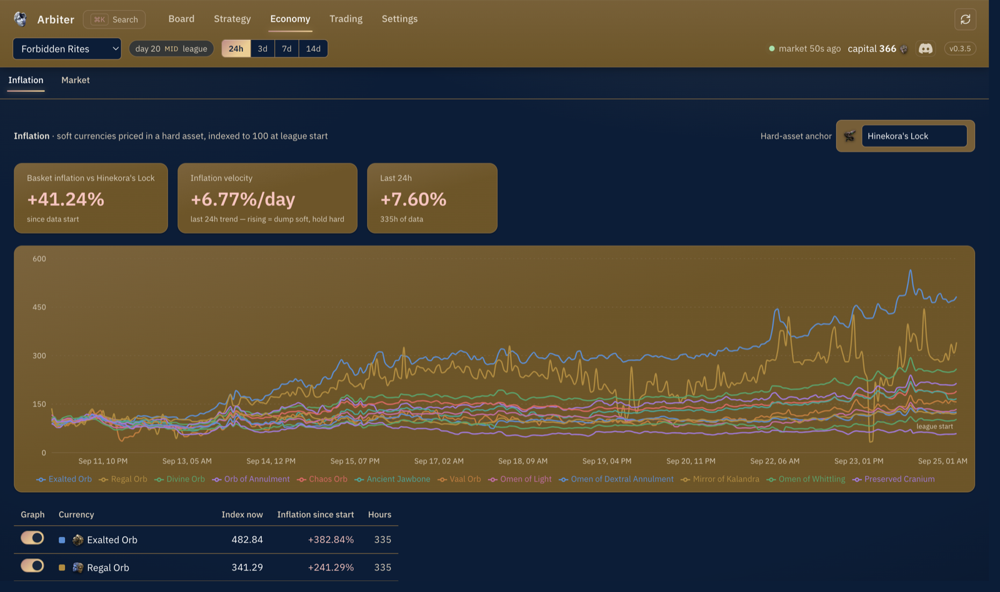
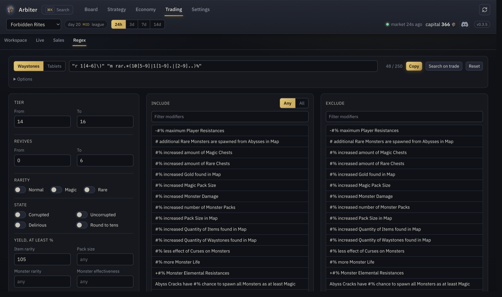

# Arbiter

I got sick and tired of having a billion PoE2 trade tabs open so I built Arbiter. Its your one
stop shop for trading, market research, and protecting your stash against inflation.

## Arbitrage

It runs an arbitrage simulation. You tell it what you hold and it finds currency exchange loops
(vendor recipes included) that end with more of what you started with. It scales to how much
currency you have in your bank, charges the real gold fees, figures out how long each step takes
to fill from actual hourly volume, and ranks the loops by how fast they earn per gold. You can
weight it based on how valuable you think gold is. I've been using it to make quite a bit of
currency.

## Hold

It tells you which currencies are going to be resistant to inflation and are good assets to park
wealth in. Scores every currency as a store of value and shows you which ones are holding and
which ones are about to move, so your profits don't melt while you're not looking.

## Prices

Its a price dashboard too. Every currency, priced off the market that actually trades it, with the
hourly history behind it. Click a card for the full history and every market it trades in.

## Trading

Its a trade site wrapper. The real trade site, logged in, inside the app, with folders for
different types of trade searches (mapping, crafting, flipping, whatever). Copy an item in game
and it shows up in an ExiledExchange2 history folder with a search ready to run. Every search is
Instant Buyout so travel to hideout just works.

Live trade webhooks. Set a search to listen for live trades and hit `Ctrl+G` to instantly bring
up the latest ping and travel. You never leave the game.

## Regex

A stash search builder. Pick the waystone tier, revives, mods you want and mods you don't, or the
tablet kind and its mods, and it writes the search box string for you. Knows the 250 character
limit. The same selection can go straight to the trade site as a search.

## Sales

What sold, when, for how much, next to what you're holding.

## Themes

| Vault (default) | Arbiter of Ash | Arbiter of Divinity |
|---|---|---|
|  |  |  |

| Trial of the Sekhemas | Vaal | Azmeri |
|---|---|---|
|  |  |  |

## The pages

| | |
|---|---|
|  |  |
| Arbitrage. Loops sized to your bank, ranked by how fast they earn. | Hold. Where wealth keeps. |
|  |  |
| Economy. The league's inflation and its hub currencies. | Regex. The stash search, written for you. |

## Get it

[Windows installer and Mac dmg](https://github.com/Shazambom/shazam-poe2-dashboard/releases/latest).
Install it, log in once from the top bar (normal pathofexile.com login, Steam works too), done. It
updates itself.

Everything runs on your machine. No account, no server, nothing phoning home. It talks to GitHub
for updates and to pathofexile.com on your own login and thats it.

The trading stuff is based off of Better Trading somewhat. The rest is what I wanted to exist.
